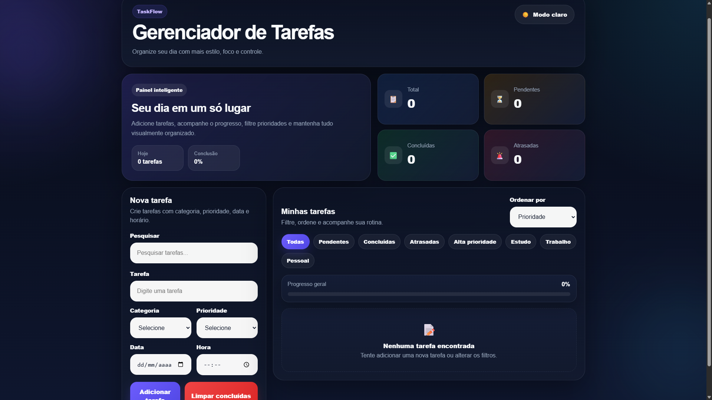

# Gerenciador de Tarefas


Aplicação web para gerenciamento de tarefas com foco em organização, produtividade e experiência visual moderna.

---

## Acesse o projeto

https://gowtlr.github.io/task-manager/

---

## Preview



---

## Funcionalidades

- Adicionar tarefas  
- Editar tarefas (modal)  
- Excluir tarefas  
- Marcar como concluídas  
- Definir prioridade (Baixa, Média, Alta)  
- Definir categoria (Estudo, Trabalho, Pessoal)  
- Adicionar data e hora  
- Pesquisa com autocomplete  
- Filtros por status, categoria e prioridade  
- Ordenação por prioridade, data e mais recentes  
- Barra de progresso  
- Indicadores (total, pendentes, concluídas, atrasadas)  
- Tema claro e escuro  
- Layout responsivo  
- Persistência de dados com localStorage  

---

## Tecnologias utilizadas

- HTML5  
- CSS3  
- JavaScript (Vanilla)  

---

## Melhorias implementadas

- Tratamento seguro do localStorage  
- Normalização de dados ao carregar tarefas  
- Busca mais robusta  
- Correção do botão de tema (ícone e texto sincronizados)  
- Aplicação do tema no carregamento da página  
- Validação no formulário de edição  
- Ajustes de responsividade  
- Correção de encoding de textos  

---

## Estrutura do projeto

```bash
index.html
style.css
script.js
